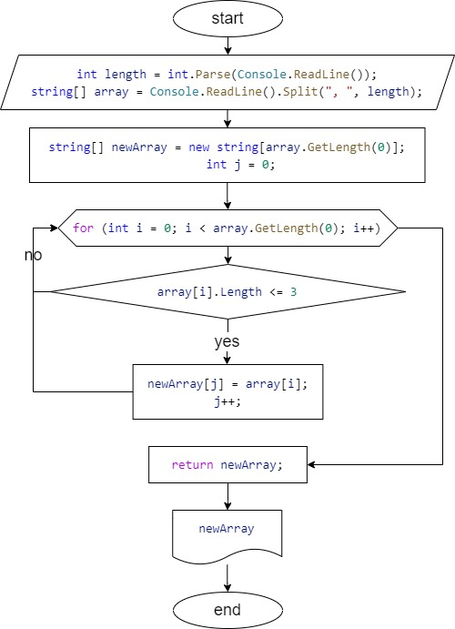

# __Итоговая работа__

## **Задача**: 
Написать программу, которая из имеющегося массива строк формирует новый массив из строк, длина которых меньше, 
либо равна 3 символам. Первоначальный массив можно ввести с клавиатуры, либо задать на старте выполнения алгоритма. 
При решении не рекомендуется пользоваться коллекциями, лучше обойтись исключительно массивами.

*__Примеры:__*

[“Hello”, “2”, “world”, “:-)”] → [“2”, “:-)”]

[“1234”, “1567”, “-2”, “computer science”] → [“-2”]

[“Russia”, “Denmark”, “Kazan”] → []

## **Блок-схема программы**



## **Описание программы**

В программе используется *3 функции*:
* void StringArrayFindElements()
* string[] FindElements(string[] array)
* void PrintArray(string[] array)

Программа заключена в функцию **void StringArrayFindElements()**, где мы получаем от пользователя длинну массива и сам массив, и выводим получившийся в результате массив на экран.

Для поиска в массиве элементов, содержащих 3 и менее символов, используется функция **string[] FindElements(string[] array)**. Здесь мы создаем новый массив и записываем в него нужные элементы.

Для вывода получившегося массива используется функция **void PrintArray(string[] array)**. 

## **Результат вывода**

```
Input array length: 4
Input array: hello, 2, world, :-)
[2, :-)]
```
```
Input array length: 4
Input array: 1234, 1567, -2, computer science
[-2]
```
```
Input array length: 3
Input array: Russia, Denmark, Kazan
[]
```